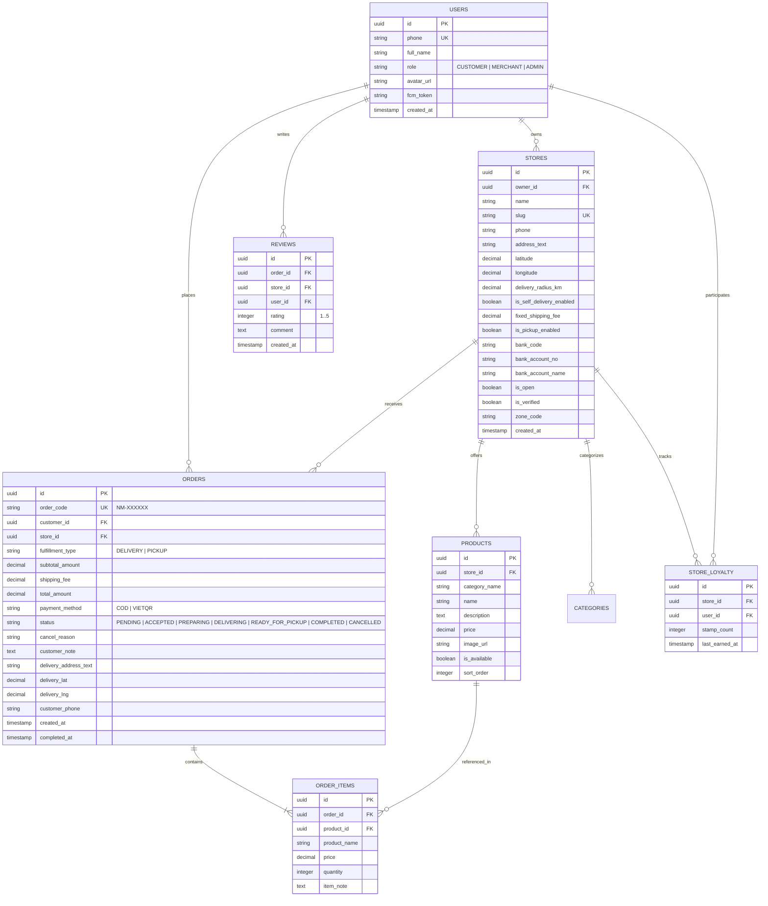
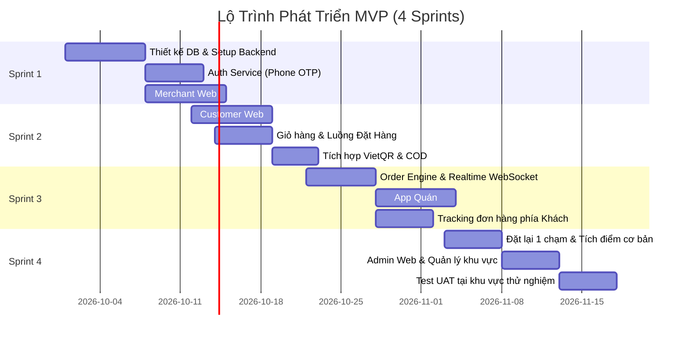

# TÀI LIỆU YÊU CẦU TÍNH NĂNG MVP (MVP PRODUCT REQUIREMENTS DOCUMENT)
## Dự án: NỀN TẢNG KẾT NỐI QUÁN ĐỊA PHƯƠNG "NHÀ MÌNH"
> **Dành cho:** Tech Lead, Solution Architect, Frontend/Backend Developers, Mobile Developers & QA Team.  
> **Căn cứ tài liệu gốc:** [nha-minh.md](file:///Users/anfin/Desktop/Workspace/nha-minh/nha-minh.md)  
> **Phiên bản:** MVP 1.0 (Giai đoạn thử nghiệm khu vực hẹp: 1 phường / cụm dân cư - 20-30 quán)

---

## 1. TỔNG QUAN DỰ ÁN & MỤC TIÊU MVP

### 1.1. Tầm nhìn & Định vị
"Nhà Mình" là **chợ online của quán địa phương**:
- **Khách hàng:** Mua đồ ăn, thức uống, tạp hóa quen thuộc với **giá gốc tại quán**, không bị đội giá do hoa hồng.
- **Chủ quán:** Có kênh tiếp cận khách mới và giữ chân khách quen trong bán kính gần. **Nền tảng cam kết KHÔNG thu % hoa hồng trên từng đơn hàng (0% Commission)**.
- **Vận hành Logistics (Lớp A):** Quán tự giao hoặc khách tự đến lấy (Pickup). Nền tảng không can thiệp logistics ở MVP, loại bỏ hoàn toàn chi phí và rủi ro vận hành đội xe.
- **Mô hình doanh thu tương lai:** Thuê bao cố định theo tháng (miễn phí ở MVP), phí tính năng đẩy tin/quảng bá khu vực, và công cụ quản trị nâng cao.

### 1.2. Mục tiêu kỹ thuật giai đoạn MVP
1. **Pilot tại 1 khu vực nhỏ (Geofenced Cluster):** Triển khai cho 20–30 quán đầu tiên và 500–1.000 cư dân trong 1 phường/khu dân cư.
2. **Khắc phục triệt để vấn đề bán qua Zalo/Facebook:** Cung cấp trang menu chuyên nghiệp, giỏ hàng, tính tiền tự động, ghi nhận địa chỉ chuẩn xác, không bị sót đơn.
3. **Chống rò rỉ (Platform Retention):** Tính năng đặt lại 1 chạm (1-click reorder), lưu quán quen, tích điểm thẻ điện tử, và chuông báo đơn real-time giúp chủ quán gắn bó hàng ngày.
4. **Tối ưu tốc độ & chi phí hạ tầng:** Ứng dụng nhẹ, tải nhanh trên mạng 3G/4G, thời gian phát triển ngắn (4–6 tuần).

---

## 2. KIẾN TRÚC TỔNG THỂ & STACK CÔNG NGHỆ ĐỀ XUẤT

```mermaid
graph TD
    subgraph ClientLayer [Tầng Ứng Dụng (Client Apps)]
        CW[Customer Web / PWA]
        CA[Customer Mobile App - iOS/Android]
        MW[Merchant Web Dashboard]
        MA[Merchant Mobile App - Chuông báo đơn]
        AD[Admin Web Portal]
    end

    subgraph GatewayLayer [API & Real-time Layer]
        API[Backend API Gateway - RESTful]
        WS[Real-time Engine - WebSocket / SSE]
        FCM[Firebase Cloud Messaging - Push Alerts]
    end

    subgraph DataLayer [Lưu Trữ & Hạ Tầng]
        DB[(PostgreSQL - Primary Database)]
        Redis[(Redis - Cache & Order Queue)]
        Storage[(S3 / Cloudflare R2 - Hình ảnh)]
    end

    CW --> API
    CA --> API
    MW --> API
    MA --> API
    AD --> API

    CA -.-> FCM
    MA -.-> FCM
    MA <--> WS
    MW <--> WS

    API --> DB
    API --> Redis
    API --> Storage
```

### Đề xuất Tech Stack cho Tech Team:
| Phân hệ | Công nghệ đề xuất | Lý do lựa chọn |
|---|---|---|
| **Customer Web (Khách mua)** | **Next.js (React) / SSR hoặc PWA** | Tối ưu SEO địa phương, chia sẻ link quán qua Zalo/Facebook tải tức thì, chạy mượt trên Safari/Chrome mobile. |
| **Mobile Apps (Khách & Quán)** | **Flutter** (hoặc React Native) | 1 codebase build cho cả iOS & Android; xử lý push notification và âm thanh nền (alert ringtone) cực tốt trên thiết bị di động. |
| **Merchant / Admin Web** | **React / Vite + Tailwind CSS** | Giao diện quản lý nhanh, gọn, dễ maintain, tương thích tốt trên máy tính bảng và desktop. |
| **Backend Services** | **Node.js (NestJS) hoặc Golang** | Hiệu năng xử lý concurrency cao, xử lý I/O đơn hàng và socket real-time ổn định. |
| **Cơ sở dữ liệu (Database)** | **PostgreSQL (hỗ trợ PostGIS)** | Xử lý dữ liệu quan hệ chặt chẽ (Đơn hàng, Menu, Khách), PostGIS tính toán tọa độ và bán kính giao hàng chuẩn xác. |
| **Realtime & Push Notification** | **Firebase Cloud Messaging (FCM) + WebSockets** | Push thông báo tức thì khi có đơn mới; WebSockets cập nhật trạng thái đơn trực tiếp trên màn hình. |
| **Thanh toán MVP** | **VietQR Tĩnh/Động + COD** | Khách quét mã QR chuyển khoản thẳng vào số tài khoản chủ quán (Zero Platform Escrow, không lo pháp lý ví điện tử ở MVP). |

---

## 3. CÁC TÁC NHÂN HỆ THỐNG (ACTORS)

1. **Khách hàng (Customer / Buyer):** Người tiêu dùng trong khu vực, đặt món/hàng hóa giá gốc, nhận hàng tự giao hoặc đến quán lấy.
2. **Chủ quán (Merchant / Seller):** Quán ăn, trà sữa, tạp hóa, tiệm bánh tại nhà; quản lý thực đơn, nhận chuông báo đơn, tự giao hoặc chuẩn bị hàng cho khách lấy.
3. **Quản trị viên (Super Admin / Operations):** Đội ngũ phát triển; duyệt quán, cấu hình cụm khu vực (phường/xã), quản lý danh mục, xem báo cáo tăng trưởng.

---

## 4. CHI TIẾT TÍNH NĂNG MVP THEO PHÂN HỆ

### PHÂN HỆ 1: KHÁCH HÀNG (CUSTOMER WEB & APP)

#### 1.1. Khám phá & Định vị (Location & Discovery)
- **Chọn khu vực hoạt động:** Khách chọn khu vực đang sống (ví dụ: *Phường Linh Tây, TP. Thủ Đức* hoặc toà chung cư).
- **Định vị & Lọc quán gần:** Tự động tính khoảng cách từ vị trí khách tới quán (dựa trên GPS hoặc địa chỉ đã chọn).
- **Danh sách quán theo nhóm:**
  - *Quán quen quanh bạn* (< 2km).
  - *Danh mục:* Cơm/Mì/Phở, Trà sữa/Cà phê, Ăn vặt, Tạp hóa/Nhu yếu phẩm, Thực phẩm làm sẵn.
  - *Bộ lọc:* Quán đang mở cửa, Quán hỗ trợ tự giao, Quán chỉ nhận tự lấy (pickup).
- **Huy hiệu "Giá gốc tại quán":** Nhãn xác thực minh bạch giá tại quán để kích thích chuyển đổi.

#### 1.2. Trang Gian Hàng & Thực Đơn (Storefront & Menu)
- **Thông tin quán:** Tên quán, địa chỉ cụ thể, khoảng cách, giờ mở cửa/đóng cửa, hotline/Zalo chủ quán.
- **Thực đơn trực quan:**
  - Phân nhóm món (Khai vị, Món chính, Đồ uống, Topping).
  - Hình ảnh món ăn rõ nét, tên món, mô tả ngắn, giá niêm yết.
  - Trạng thái món: *Còn hàng* / *Hết hàng hôm nay* (real-time).
- **Tùy chọn món (Item Customization cơ bản):**
  - Số lượng (+ / -).
  - Ghi chú món (ví dụ: *không cay, ít ngọt, nhiều đá*).

#### 1.3. Giỏ Hàng & Đặt Hàng (Cart & Checkout)
- **Giỏ hàng đơn quán:** Mỗi đơn hàng thuộc về 1 quán duy nhất (hiển thị cảnh báo nếu thêm món từ quán khác).
- **Chọn hình thức nhận hàng (Fulfillment):**
  1. **Quán tự giao (Delivery):** Nhập địa chỉ giao hàng, số điện thoại người nhận, chọn mốc thời gian giao mong muốn. Hệ thống kiểm tra xem địa chỉ có nằm trong bán kính giao của quán không.
  2. **Khách tự đến lấy (Pickup):** Chọn giờ dự kiến ghé lấy hàng (ví dụ: *Sau 15 phút, 30 phút*). Phí ship = 0đ.
- **Ghi chú đơn hàng tổng thể:** Lời nhắn cho chủ quán (ví dụ: *Giao tại sảnh chung cư A*).
- **Tóm tắt chi phí:**
  - Tiền hàng (Tổng giá món).
  - Phí giao hàng (Do quán quy định, hiển thị rõ ràng).
  - Tổng số tiền cần trả.

#### 1.4. Thanh Toán MVP (Payment Methods)
- **Tiền mặt khi nhận hàng (COD):** Trả trực tiếp cho quán khi giao hoặc khi đến lấy hàng.
- **Chuyển khoản VietQR trực tiếp:**
  - Tạo mã QR chuyển khoản tự động kèm: *Số tài khoản ngân hàng của chủ quán*, *Tên chủ tài khoản*, *Số tiền chính xác*, *Nội dung chuyển khoản (Mã đơn hàng)*.
  - Khách quét app ngân hàng thanh toán trực tiếp cho chủ quán.
  - Nền tảng không giữ tiền trung gian (tránh rủi ro pháp lý giấy phép trung gian thanh toán).

#### 1.5. Theo Dõi Đơn Hàng (Order Tracking)
- **Màn hình trạng thái đơn theo thời gian thực:**
  - `CHỜ XÁC NHẬN (PENDING)`: Quán đang nhận thông báo.
  - `ĐÃ NHẬN ĐƠN (ACCEPTED)`: Quán đã bấm nhận.
  - `ĐANG CHUẨN BỊ (PREPARING)`: Quán đang làm món/đóng hàng.
  - `ĐANG GIAO HÀNG (DELIVERING)`: Quán bắt đầu mang đi giao (với đơn giao tận nơi).
  - `SẴN SÀNG LẤY (READY_FOR_PICKUP)`: Hàng đã chuẩn bị xong (với đơn tự đến lấy).
  - `HOÀN THÀNH (COMPLETED)`: Giao dịch thành công.
  - `ĐÃ HUỶ (CANCELLED)`: Quán từ chối (kèm lý do: hết món, ngoài giờ...) hoặc khách huỷ trước khi quán nhận.
- **Nút liên hệ nhanh:** Gọi điện thoại trực tiếp hoặc mở Zalo với chủ quán bằng số hotline đã đăng ký.

#### 1.6. Tính Năng Giữ Chân (Retention & Anti-leakage)
- **Đặt lại 1 chạm (1-Click Reorder):** Xem lịch sử các đơn đã đặt, bấm "Đặt lại" để tự động thêm đúng các món và địa chỉ trước đó vào giỏ hàng.
- **Quán yêu thích:** Bấm tim lưu quán quen lên đầu trang chủ để mở lại nhanh.
- **Thẻ tích điểm điện tử (Digital Stamp Card):**
  - Cơ chế đơn giản: Mỗi đơn hoàn thành tại quán = 1 điểm/tem.
  - Đạt đủ số điểm (ví dụ: 10 tem) được hưởng ưu đãi (ví dụ: tặng 1 phần nước do quán quy định).
- **Đánh giá quán (Review & Rating):** Khách đánh giá 1-5 sao và để lại nhận xét sau khi đơn hoàn thành.

---

### PHÂN HỆ 2: CHỦ QUÁN (MERCHANT WEB & MOBILE APP)

> **Lưu ý quan trọng cho Mobile Dev:** Trải nghiệm nhận đơn của chủ quán là "sinh tử" của sản phẩm. Khi có đơn mới, App Quán phải phát **chuông báo to, liên tục và rung** giống như máy POS Grab/ShopeeFood cho đến khi chủ quán bấm xem đơn.

#### 2.1. Đăng Ký & Thiết Lập Quán (Store Onboarding)
- **Đăng ký tài khoản:** Bằng Số điện thoại (xác thực OTP SMS hoặc Firebase Phone Auth).
- **Hồ sơ quán:**
  - Tên quán, ảnh đại diện (avatar/logo), ảnh bìa quán.
  - Địa chỉ chính xác + ghim vị trí GPS trên bản đồ.
  - Số điện thoại liên hệ & số Zalo bán hàng.
  - Thông tin tài khoản ngân hàng nhận tiền (Ngân hàng, Số tài khoản, Tên chủ thẻ) để tạo mã VietQR.
- **Cấu hình giao hàng (Lớp A):**
  - Bật/Tắt tính năng "Quán tự giao hàng".
  - Thiết lập bán kính giao hàng tối đa (ví dụ: 1km, 2km, 3km).
  - Bảng phí ship của quán: Đồng giá (ví dụ: 10.000đ) hoặc Miễn phí ship (Freeship) hoặc tính theo km (ví dụ: 5.000đ/km).
  - Bật/Tắt tính năng "Khách tự đến lấy (Pickup)".
- **Giờ hoạt động:** Cài đặt khung giờ mở cửa/đóng cửa từng ngày trong tuần. Nút gạt nhanh: *Mở cửa / Tạm nghỉ*.

#### 2.2. Quản Lý Thực Đơn (Menu Management)
- **Nhóm món:** Tạo nhóm (Cơm, Canh, Nước ngọt, Trà...).
- **Thêm / Sửa / Xóa món ăn:**
  - Tên món, giá bán gốc, mô tả, ảnh chụp món ăn (chụp trực tiếp từ camera điện thoại hoặc upload).
- **Bật/Tắt hết hàng nhanh (Quick Toggle Availability):** Nút gạt 1 chạm ngay trên danh sách món để đánh dấu hết món khi quán hết nguyên liệu trong ngày.

#### 2.3. Quản Lý Đơn Hàng Thời Gian Thực (Order Fulfillment)
- **Màn hình Tiếp nhận đơn (Live Order Board):**
  - Phân chia tab rõ ràng: `MỚI (CHỜ NHẬN)` | `ĐANG LÀM` | `ĐANG GIAO / CHỜ LẤY` | `LỊCH SỬ`.
- **Cảnh báo đơn mới:**
  - Âm thanh chuông báo lặp lại to rõ, pop-up toàn màn hình hiển thị chi tiết đơn.
  - Hiển thị thời gian đếm ngược nhận đơn (ví dụ: 3 phút).
- **Thao tác đơn hàng:**
  - Bấm **"Nhận đơn"** -> Chuyển sang Đang làm.
  - Bấm **"Từ chối đơn"** -> Chọn lý do (Hết món, Quá tải, Ngoài vùng ship...).
  - Bấm **"Bắt đầu giao"** (với đơn quán tự giao) hoặc **"Sẵn sàng lấy"** (với đơn pickup - gửi thông báo đẩy đến khách).
  - Bấm **"Hoàn thành"** sau khi giao xong và nhận tiền.

#### 2.4. Quản Lý Khách Quen & Thống Kê Cơ Bản (CRM & Analytics)
- **Thống kê trong ngày/tuần:**
  - Tổng số đơn đã bán.
  - Doanh thu ước tính (tổng tiền món).
  - Top món bán chạy nhất.
- **Danh sách khách quen:**
  - Danh sách khách đã từng đặt hàng tại quán, số lần đặt, ngày đặt gần nhất.
  - Danh sách khách đang tích điểm thẻ tem tại quán.

---

### PHÂN HỆ 3: QUẢN TRỊ VIÊN (SUPER ADMIN WEB PORTAL)

#### 3.1. Quản Trị Khu Vực & Cụm Dân Cư (Geofence / Zones)
- Tạo và kích hoạt các khu vực thử nghiệm (ví dụ: Cụm KDC Hiệp Bình Chánh, Phường Linh Tây, Ký túc xá ĐHQG...).
- Gán các quán vào từng cụm khu vực.

#### 3.2. Quản Trị Quán & Phê Duyệt (Merchant Management)
- Xem danh sách quán đăng ký mới, kiểm tra thông tin, duyệt (Approve) hoặc tạm khóa (Suspend).
- Gắn huy hiệu "Đã xác thực giá gốc" (Verified Merchant).
- Xem toàn bộ danh sách menu của từng quán.

#### 3.3. Quản Trị Danh Mục Hệ Thống (Global Categories)
- Thiết lập danh mục dùng chung: Cơm, Bún/Phở, Đồ uống, Tạp hóa, v.v.

#### 3.4. Báo Cáo & Đo Lường Chỉ Số Rò Rỉ (Leakage & Performance Metrics)
- Theo dõi các chỉ số cốt lõi đã đề ra trong tài liệu chiến lược:
  - **Tỷ lệ khách đặt lại qua nền tảng (Platform Retention / Repeat Rate):** Số khách đặt từ lần thứ 2 trở lên.
  - **Mức độ hoạt động của quán (Merchant Daily Active):** Tỉ lệ quán mở app và nhận đơn mỗi ngày.
  - **Tỷ lệ từ chối đơn của quán (Rejection Rate).**
  - **Tổng giá trị giao dịch ước tính (GMV) toàn cụm.**

---

## 5. THIẾT KẾ CƠ SỞ DỮ LIỆU CỐT LÕI (CORE DATABASE SCHEMA)

Tech team có thể tham khảo thiết kế cấu trúc thực thể (Entity) chuẩn PostgreSQL dưới đây:



---

## 6. QUY TRÌNH NGHIỆP VỤ & STATE MACHINE ĐƠN HÀNG

### 6.1. State Machine Vòng Đời Đơn Hàng (Order State Machine)
```
       [Khách Đặt Đơn]
              │
              ▼
          PENDING (Chờ xác nhận)
         /       \
 (Quán Huỷ)      (Quán Nhận Đơn)
       /           \
      ▼             ▼
  CANCELLED      ACCEPTED (Đã xác nhận)
                    │
                    ▼
                 PREPARING (Đang chuẩn bị)
                 /       \
      (Giao hàng)         (Khách đến lấy)
             /               \
            ▼                 ▼
   DELIVERING (Đang giao)   READY_FOR_PICKUP (Chờ lấy)
            \                 /
             \               /
          (Giao xong & Nhận tiền)
                    │
                    ▼
                COMPLETED (Hoàn thành)
```

### 6.2. Cơ Chế Xử Lý Thanh Toán VietQR Tự Động Tạo Mã
Để quán nhận tiền thẳng vào tài khoản mà không cần tích hợp cổng thanh toán phức tạp:
1. Khi khách chọn `Chuyển khoản VietQR`, backend sinh chuỗi mã VietQR theo chuẩn Napas 247:
   - Ngân hàng: `store.bank_code`
   - Số tài khoản: `store.bank_account_no`
   - Số tiền: `order.total_amount`
   - Nội dung chuyển khoản: `NM <order_code>` (Ví dụ: `NM 883921`)
2. Khách mở app ngân hàng quét mã, thông tin và số tiền tự điền chính xác 100%.
3. Khách bấm "Tôi đã chuyển khoản". Quán nhận được tiền vào tài khoản ngân hàng và bấm "Đã nhận thanh toán" trên App Quán.

---

## 7. YÊU CẦU PHI CHỨC NĂNG (NON-FUNCTIONAL REQUIREMENTS)

1. **Độ trễ thông báo đơn mới (Real-time Alert Latency):**
   - Đơn hàng từ khi khách bấm Đặt -> App Quán phải đổ chuông trong vòng **dưới 2 giây**.
   - Cơ chế fallback: Nếu WebSocket mất kết nối, hệ thống kích hoạt Firebase High-Priority Push Notification ngay lập tức.
2. **Âm thanh thông báo liên tục (Wake-lock & Loud Ringtone):**
   - App Quán khi nhận đơn phải kích hoạt âm thanh chuông đặc trưng và rung, kể cả khi màn hình điện thoại đang tắt hoặc app đang chạy ngầm.
3. **Hiệu năng tải trang Web Khách (Performance):**
   - First Contentful Paint (FCP) trên mạng di động 4G < 1.5 giây.
   - Dung lượng bundle web tải lần đầu < 300KB (nén gzip/brotli).
4. **Bảo mật & Toàn vẹn dữ liệu:**
   - Số điện thoại của khách chỉ hiển thị cho quán sau khi đơn được bấm nhận.
   - Mã hóa mật khẩu/token, kiểm soát phân quyền Row Level Security (RLS) để quán này không đọc được dữ liệu đơn quán khác.

---

## 8. KẾ HOẠCH TRIỂN KHAI THEO SPRINT (4-6 TUẦN MVP)



- **Sprint 1 (Tuần 1 - 2): Hạ tầng cốt lõi & Quản lý Gian hàng**
  - Dựng DB PostgreSQL, NestJS/Go API base.
  - Xây dựng luồng đăng ký bằng SĐT cho Quán & Khách.
  - Giao diện Merchant Web: Đăng ký quán, upload menu, bật/tắt món, cấu hình phí ship.
- **Sprint 2 (Tuần 3): Mua hàng & Thanh toán phía Khách**
  - Customer Web/PWA: Trang chủ định vị cụm khu vực, danh sách quán, xem chi tiết món.
  - Giỏ hàng, chọn giao hàng hoặc tự lấy.
  - Sinh mã VietQR tự động và lựa chọn COD.
- **Sprint 3 (Tuần 4): Realtime Order Processing**
  - Hệ thống Socket/Push notification nhận đơn.
  - App Quán (Mobile): Màn hình nhận đơn chuông to, chấp nhận/từ chối đơn, cập nhật trạng thái đơn.
  - Màn hình Tracking đơn hàng thời gian thực cho Khách.
- **Sprint 4 (Tuần 5 - 6): Giữ chân, Admin & Kiểm thử Pilot**
  - Tính năng Đặt lại 1 chạm (1-click reorder), Thẻ tích điểm tem điện tử.
  - Admin Web: Duyệt quán, xem thống kê chỉ số đơn.
  - UAT thực tế tại 20 quán mục tiêu, fix bugs và phát hành nội bộ.

---

## 9. ĐIỀU KIỆN NGHIỆM THU (DEFINITION OF DONE - DOD)

1. **Khách hàng:**
   - Mở web/app, tìm được quán trong bán kính chọn, xem menu đúng giá.
   - Thêm món, chọn giao tận nơi (tự tính đúng phí ship của quán) hoặc tự lấy.
   - Quét mã VietQR chuyển khoản chính xác nội dung hoặc chọn COD.
   - Xem được trạng thái đơn đổi theo thời gian thực khi quán thao tác.
   - Bấm đặt lại đơn cũ thành công trong 1 chạm.
2. **Chủ quán:**
   - Dễ dàng tự sửa giá món, bật/tắt món hết hàng bằng điện thoại.
   - Có đơn mới thì điện thoại đổ chuông báo to rõ ràng ngay lập tức.
   - Thao tác Nhận đơn / Chuẩn bị / Giao hàng / Hoàn thành mượt mà, không giật lag.
   - Xem được lịch sử đơn và khách quen đã mua.
3. **Kỹ thuật & Hệ thống:**
   - 0 lỗi nghiêm trọng (Critical/Blocker) trong luồng đặt và nhận đơn.
   - Tốc độ phản hồi API trung bình < 200ms.
   - Push notification hoạt động ổn định trên cả thiết bị Android và iOS.
